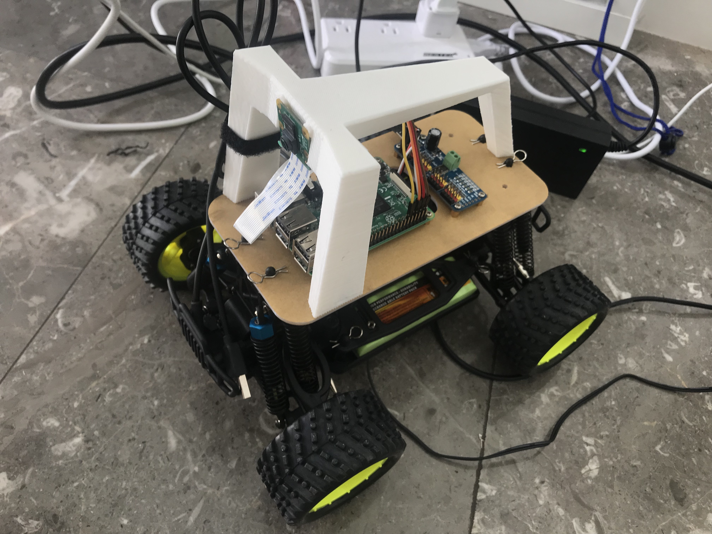

# mini_tesla_w
A trainable ,selfdriving "car" with pan til camera that can be control any where with internet access.
can be use as mobile patrol at home.
can be set on auto pilot moode for navigation.

# Features
1. Access control in different region as long as with access to the internet
2. Soloar powered communication and control system
3. Wireless charging motro power system with wirless charging base station
4. Pan til camera as mobile survillient tool
5. Self driving

# Overview:
user use vnc to remote login to the pi and use TCP and send command to local host, at the same time 
the car will send back live image to the car.

pygame has been usesd so that car can be controled using the keyboard.

Train: 
with control and the image use a neuro network to train the car for later self driving

Demo link:
https://youtu.be/TO06dV4IT2A

## TCP Socket:
Sender will continously send the sender the current key pressed status and will use 'n' as dummy place holder just to make sure that even there is no key pressed , the client socket will still contious receing message so that the camera can continously capture the image and label it.

## Control:
receiver will received the current status of the keyboard:
i->forward;k->back;j->left;l->right;space->stop
at the same time receiver will keep the previous control status as well
and then translate the key pressed in to the control vector in the order of [i,k,l,j,space]
e.g. ik -> [1,1,0,0,0,0]

then by oxr the previoius control vector with the current one and find out the index value of 1 of the current control vetor is 0 or 1 we can know what keys are updated and from what direction(pressed -> release or released -> pressed)

Based on the key stauts update we can control the car accordingly

## Data Collection
We will use pi camera to capture gray image and stamp the image with the current control status saved it in the data folder for later training.
As mentioned in the TCP section , the sender will contionously sending packet at interval of 0.1 second so the camera will keep capture image with the current control label.

## Training

## Auto Pilot
At intevel of 0.1 second will send the captured frame to the trained model and it will output a control vector.
Like previously in the control section, we keep track of the previous control vector and the current control vector to act control to the car accordingly.

